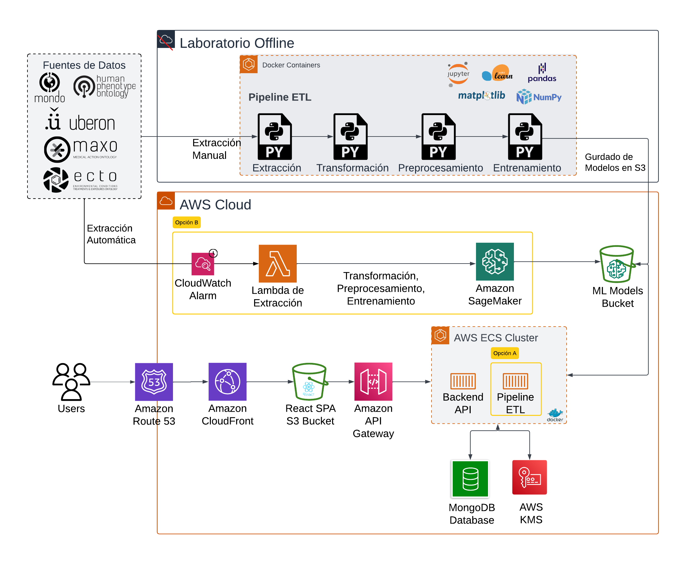

[](https://github.com/UADE-PFI-Lacuesta-Rondan/pfi-spa/actions/workflows/react-app-build.yaml) \
Prototipo para predicción y exploración visual de términos médicos utilizando fuentes Linked Open Data (LOD).

Este prototipo permite el diagnóstico de enfermedes a través de la sintomatología, que es la utilización de signos o síntomas visibles de una enfermedad para realizar un diagnósitico presuntivo utilizando fuentes de datos abiertos y vinculados. Este esta enmarcado en el proyecto de investigación “P24T02 – Tecnologías de la Información facilitadoras para Linked Open Data (LOD)” del Instituto de Tecnología (INTEC) de la Universidad Argentina de la Empresa (UADE).

### ¿Por qué APOLLOD?
Apolo: el dios griego de la medicina y el conocimiento. \
LOD: Linked Open Data o Datos Abiertos Enlazados, el corazón del prototipo, su fuente de datos.

# Arquitectura


### Extracción Automática de ontologías
Se investigaron dos alternativas para realizar la extracción automática de ontologías. \
Opción A: solución implementada, un contenedor que contiene el Pipeline de ETL del laboratorio offline. \
Opción B: no implementada por generación de costos adicionales pero es una potencial solución alternativa.

### Servicios Utilizados
Servicios: ECS + Contenedores en Docker \
Persistencia: MongoDB, S3 (Datalake) \
Secretos: AWS KMS \
Front: Route 53, cloudFront, S3, API Gateway

# Ejecutar el proyecto
Revisa las siguientes secciones y su contenido para ejecutar el proyecto localmente.

Para más información sobre el backend: \
[Backend README](./backend/README.md)

Para más información sobre el frontend: \
[Frontend README](./frontend/README.md)

### Backend
Ejecutar Backend
```bash
docker compose -f ./backend/docker-compose.yaml up --build
```
Nota: levantar por primera vez puede tomar unos minutos ya que se entrenan los modelos durante el deployment del pipeline etl container, particularmente en el log: \
```bash
random forest 6 - training the model
```
Nota: levantar por primera vez puede tomar unos minutos ya que se entrenan los modelos durante el deployment del pipeline etl container, particularmente en los logs que dicen "entrenando modelo". Tiempo de ultima corrida: 902.53 seconds, aprox ~15 minutos.

Levanta en:
http://127.0.0.1:80

### Frontend
Ejecutar FrontEnd \
Antes de la ejecución, cambiar la URL del archivo /pfi-spa/frontend/src/services/webService.ts, cambiando la productiva por la local.
```bash
const url = 'https://api.apollod.org/v1'
// const url = 'http://127.0.0.1:80/v1'
```

```bash
cd ./frontend && npm run dev
```

Levanta en:
http://127.0.0.1:5173/

# Descarga de Responsabilidad
El prototipo se desarrolla con la intención de generar conocimiento replicable en el área y únicamente con fines informativos y educativos. La información proporcionada no debe ser utilizada como sustituto de la consulta médica profesional.
Debido a que las fuentes de datos son de orígenes externos este proyecto no garantiza la exactitud o integridad de la información proporcionada, pese a que las fuentes aplican procesos pertinentes para la curación y validación de los datos. El uso de esta aplicación no crea una relación médico-paciente y no debería retrasar la búsqueda de consejo médico profesional.

# Referencias
Este proyecto utiliza [MONDO](https://github.com/monarch-initiative/mondo) como fuente de datos principal.

