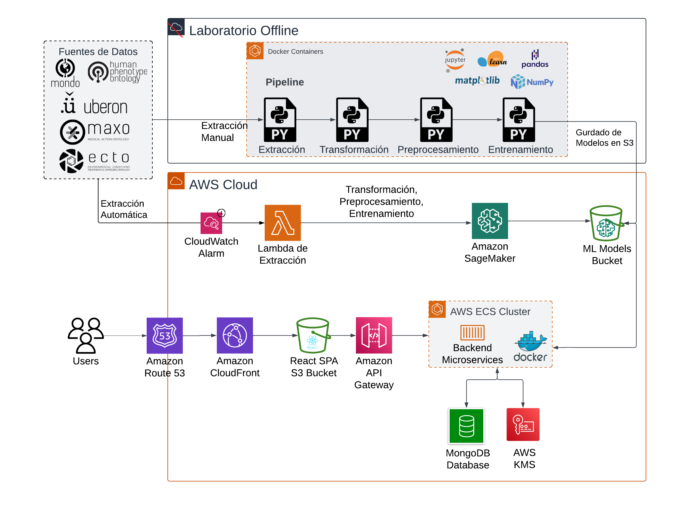

# Repositorio de Backend
Repositorio que contiene:
- Script para generación de modelo de datos
- Backend API con endpoints para integración con frontend.

## Arquitectura 


# Ejecutar Laboratorio Offline
## Requirimientos
- MongoDB
- Flask
- Docker / Docker Compose

## Ejecutar backend
docker compose up --build

Levanta en:
http://127.0.0.1:5000

# API REST
Acceder a toda la especificación de la API REST:\
http://127.0.0.1:5000/v1/docs 

Ejemplo para obtener la enfermedad "inflammatory disease" \
http://127.0.0.1:5000/v1/disease/MONDO_0021166

# MONGO DB
MONGODB conn string
mongodb://localhost:27018/

# Modelo de Datos
```mermaid
classDiagram
    class Disease {
        +String id
        +String name
        +String description
        +String titulo
        +String parentDisease
        +List childrenDiseases
        +List causes
        +List treatments
        +List anatomical_structures
        +List phenotypes
        +List exposures
        +List chemicals
        +List age_onsets
    }

    class Chemical {
        +String id
        +String name
        +String description
    }

    class Exposure {
        +String id
        +String name
        +String description
    }

    class Phenotype {
        +String id
        +String name
        +String description
    }

    class Relationship {
        +String id
        +String name
        +String description
    }

    class Treatment {
        +String id
        +String name
        +String description
    }

    class Anatomical {
        +String id
        +String name
        +String description
    }

    Disease --> "1" Disease : parentDisease
    Disease --> "0..*" Disease : childrenDiseases
    Disease --> "1..*" Relationship : tiene
    Disease --> "1..*" Chemical : tiene
    Disease --> "1..*" Exposure : tiene
    Disease --> "1..*" Phenotype : tiene
    Disease --> "1..*" Treatment : tiene
    Disease --> "1..*" Anatomical : tiene
